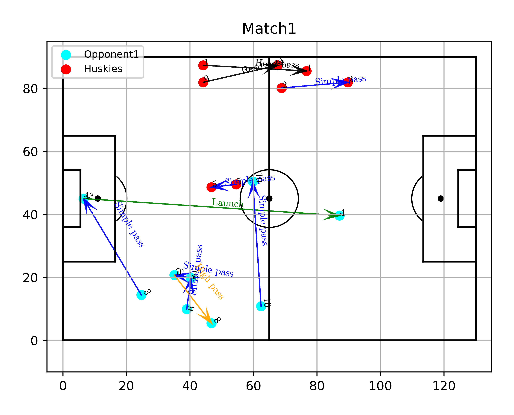

# Face-the-fears
The best way to eliminate fear is to face it

Statistiacal operation of pitch-game events

## passing events:

1. run [pitch.py](pitch.py) to create a series of pictures which present the passing events.
2. run [video.py](video.py) to create a video of passing.

### Format of the csv files:

1. matches.csv

| MatchID | OpponentID | Outcome | OwnScore | OpponentScore | Side |CoachID|
| :------: | :------: | :------: | :------: | :------: | :------: | :------: |
|1|Opponent1|win|1|0|home|Coach1|

Data Descriptions for matches.csv

<pre><code>
MatchID
A unqiue identifier for each match played during the season, and reflects the order of the match in the season.

OpponentID
A unqiue identifier for the opposing team played in the match.  Note that the Huskies play each opposing team twice during the season.

Outcome
Result of the match, eiter，win, loss, or tie.

OwnScore
Number of goals scored by the Huskies.

OpponentScore
Number of goals scored by the Opposing Team.

Side
Whether the Huskies were the home team or away' team.

CoachID
A unqiue identifier for the Huskies coach for this match.

</code></pre>

2. passingevents.csv

|MatchID |TeamID | OriginPlayerID | DestinationPlayerID |MatchPeriod|EventTime|EventSubType|EventOrigin_x|EventOrigin_y|EventDestination_x|EventDestination_y|
| :------: | :------: | :------: | :------: | :------: | :------: | :------: | :------: | :------: | :------: | :------: |
|1|Opponent1|Opponent1_D3|Opponent1_M2|1H|154.63611600000002|Simple pass|46|56|56.0|68.0|

Data Descriptions for passingevents.csv

<pre><code>
MatchID
A unqiue identifier for each match played during the season (see matches.csv).

TeamID
A unqiue identifier for the team involved in the pass (either 'Huskies' or OpponentID from matches.csv).

OriginPlayerID
A unqiue identifier for the Player at the origin of the pass.  The PlayerID has the form "TeamID_PlayerPosition##" where 'TeamID' denotes the team on which the player plays and PlayerPosition reflects the player's position.  Possible positions are: 'F':forward, 'D':defense, 'M':midfield, or 'G':goalkeeper

DestinationPlayerID
A unqiue identifier for the Player at the destination of the pass. (see OriginPlayerID)

MatchPeriod
The half in which the event took place.  '1H': first half, '2H': second half

EventTime
The time in seconds during the MatchPeriod (1st or 2nd half) at which the event took place.

EventSubType
The type of pass made. Can be one of: 'Head pass', 'Simple pass', 'Launch', 'High pass', 'Hand pass', 'Smart pass', 'Cross'.

EventOrigin_x
The x-coordinate on the field at which the pass originated. The x-coordinate is in the range [0, 100] and is oriented from the perspective of the attacking team, where 0 indicates the team's own goal, and 100 indicates the oppositing team's goal.

EventOrigin_y
The y-coordinate on the field at which the pass originated. The y-coordinate is in the range [0, 100] and is oriented from the perspective of the attacking team, where 0 indicates the team's left-hand side, and 100 indicates the team's right-hand side.

EventDestination_x
The x-coordinate on the field at the pass destination.  (see EventOrigin_x)

EventDestination_y
The y-coordinate on the field at the pass destination.  (see EventOrigin_y)

</code></pre>

3. fullevents.csv

|MatchID |TeamID | OriginPlayerID | DestinationPlayerID |MatchPeriod|EventTime|EventSubType|EventOrigin_x|EventOrigin_y|EventDestination_x|EventDestination_y|
| :------: | :------: | :------: | :------: | :------: | :------: | :------: | :------: | :------: | :------: | :------: |
| 1 | Huskies | Huskies_G1 |1H | 31.174680999999993 | Free Kick | Goal kick | 0.0 | 0.0 | 66.0 | 89.0|

Data Descriptions for fullevents.csv

<pre><code>

MatchID
A unqiue identifier for each match played during the season (see matches.csv).

TeamID
A unqiue identifier for the team involved in the pass (either 'Huskies' or OpponentID from matches.csv).

OriginPlayerID
A unqiue identifier for the Player initiating the event.  The PlayerID has the form "TeamID_PlayerPosition##" where 'TeamID' denotes the team on which the player plays and PlayerPosition reflects the player's position.  Possible positions are: 'F':forward, 'D':defense, 'M':midfield, or 'G':goalkeeper

DestinationPlayerID
A unqiue identifier for the Player at the destination of the event. (see OriginPlayerID)
NOTE: Only valid for 'Pass' or 'Subsition' event types, otherwise NaN.

MatchPeriod
The half in which the event took place.  '1H': first half, '2H': second half

EventTime
The time in seconds during the MatchPeriod (1st or 2nd half) at which the event took place.

EventType
The type of the event. Can be one of: 'Free Kick', 'Duel', 'Pass', 'Others on the ball', 'Foul', 'Goalkeeper leaving line', 'Offside', 'Save attempt', 'Shot', 'Substitution', 'Interruption'

EventSubType
The subtype of the event. Can be one of: 'Goal kick', 'Air duel', 'Throw in', 'Head pass', 'Ground loose ball duel', 'Simple pass', 'Launch', 'High pass', 'Touch', 'Ground defending duel', 'Hand pass', 'Ground attacking duel', 'Foul', 'Free kick cross', 'Goalkeeper leaving line', '', 'Free Kick', 'Smart pass', 'Cross', 'Save attempt', 'Corner', 'Clearance', 'Shot', 'Acceleration', 'Reflexes', 'Substitution', 'Late card foul', 'Simulation', 'Free kick shot', 'Protest', 'Hand foul', 'Penalty', 'Violent Foul', 'Whistle', 'Out of game foul', 'Ball out of the field', 'Time lost foul'

EventOrigin_x
The x-coordinate on the field at which the event originated. The x-coordinate is in the range [0, 100] and is oriented from the perspective of the attacking team, where 0 indicates the team's own goal, and 100 indicates the oppositing team's goal.

EventOrigin_y
The y-coordinate on the field at which the event originated. The y-coordinate is in the range [0, 100] and is oriented from the perspective of the attacking team, where 0 indicates the team's left-hand side, and 100 indicates the team's right-hand side.

EventDestination_x
The x-coordinate on the field at the event destination.  (see EventOrigin_x)

EventDestination_y
The y-coordinate on the field at the event destination.  (see EventOrigin_y)

</code></pre>

### NOTE: 
>For 'Substitution' events, the Outgoing player is the OriginPlayerID, while in the incoming player is the DestinationPlayerID
